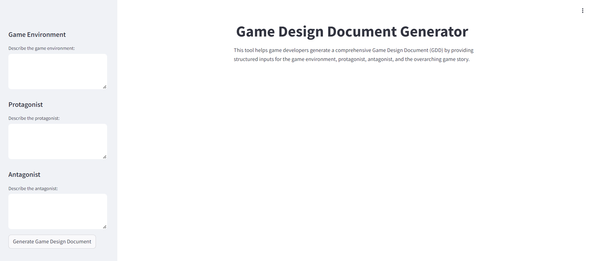

# 🕹️ Game Design Document Generator

**Game Design Document Generator** is a Streamlit application that helps game developers create comprehensive Game Design Documents (GDD) by generating detailed descriptions for the game environment, protagonist, antagonist, and the overall game story. The app leverages Claude AI from Anthropic to produce creative content based on user-provided descriptions.

## Features

- **Customizable Game Environment**: Input your ideas for the game environment, and let the app generate a detailed description.
- **Protagonist & Antagonist Design**: Provide character traits, and the app will create compelling descriptions for both the protagonist and antagonist.
- **Story Creation**: The app synthesizes the environment and character descriptions into an engaging game story.
- **API Key Management**: The app includes built-in API usage limits. After two uses, users can input their own Claude API key to continue generating content.

## Installation

1. **Clone the Repository:**

   ```bash
   git clone https://github.com/your-username/Game-Design-Document-Generator.git
   cd Game-Design-Document-Generator
   ```

2. **Install the Required Dependencies:**

   ```bash
   pip install -r requirements.txt
   ```

3. **Set Up API Key:**

   - Store your Claude API key securely in Hugging Face secrets.
   - The built-in API key allows for up to two content generations. After that, users must input their own API key.

4. **Run the Streamlit App:**

   ```bash
   streamlit run app.py
   ```

## Usage

1. **Input Game Details:**
   - Use the sidebar to describe your game environment, protagonist, and antagonist.
   
2. **Generate the GDD:**
   - Click the "Generate Game Design Document" button in the sidebar.
   - The app will generate and display detailed descriptions of the game environment, protagonist, antagonist, and the game story.

3. **API Key Limitation:**
   - The app includes a built-in API key with a limit of two uses.
   - After the limit is reached, users are prompted to enter their own Claude API key to continue generating content.

## Screenshots




## Acknowledgements

- **Anthropic's Claude AI** for providing the AI model used to generate the content.
- **Streamlit** for offering a simple and effective platform for deploying the app.

## Links

- [Claude API Information](https://www.anthropic.com/api)


